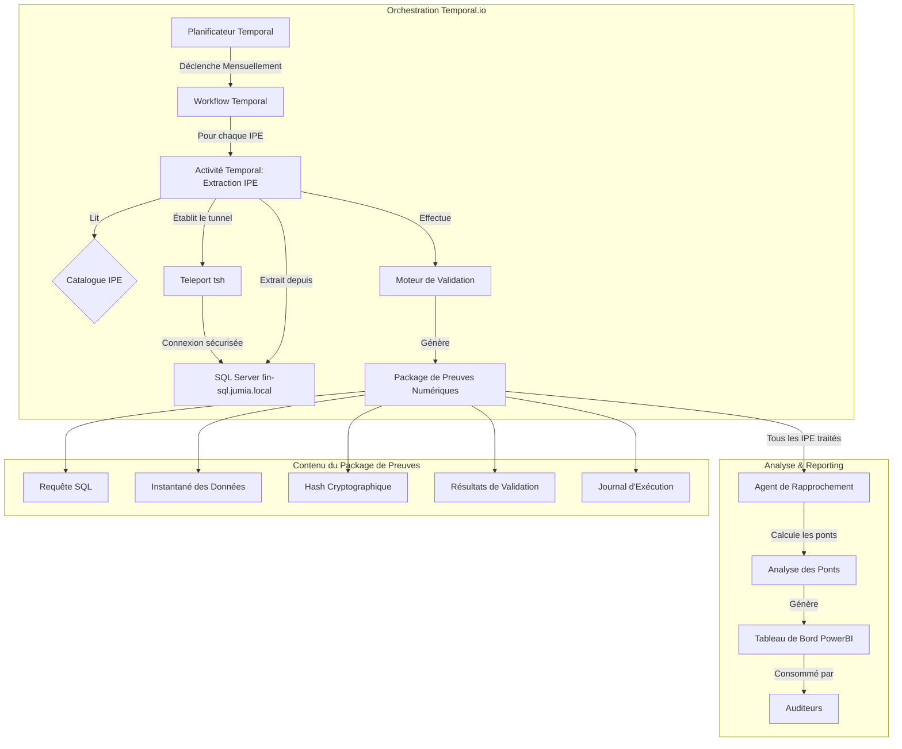

# SOXauto PG-01

> Mise à jour de l'Architecture — 2025-11-06
>
> Le système est orchestré par des Workflows Temporal.io et se connecte au MSSQL sur site via Teleport (`tsh`).
> L'orchestration précédente basée sur Flask/scripts et les plans serverless (Lambda/Fargate) sont obsolètes.
> Voir `src/orchestrators/` et `docs/deployment/temporal_worker_deploy.md`.

> NOTE SUR L'ÉTAT ACTUEL DU PROJET
>
> Le système se connecte directement au SQL Server sur site (`fin-sql.jumia.local`) via un tunnel sécurisé **Teleport (`tsh`)**. Toute l'extraction de données est effectuée à l'aide du module `mssql_runner.py`. Pour l'état opérationnel actuel et les actions suivantes, voir `PROJECT_DASHBOARD.md`.

## Architecture de Connexion

Le système se connecte à la base de données SQL Server sur site via :

- **Serveur de Base de Données** : `fin-sql.jumia.local`
- **Méthode de Connexion** : Tunnel sécurisé Teleport (`tsh`)
- **Module d'Exécution** : `src/core/runners/mssql_runner.py`
- **Orchestration** : Workflow Temporal (`src/orchestrators/cpg1_workflow.py`) + Activités (`src/orchestrators/cpg1_activities.py`)
- **Système de Preuves** : Génération complète de packages de preuves numériques pour la conformité SOX

Pour l'état d'implémentation détaillé et le suivi, voir `PROJECT_DASHBOARD.md`.

## Démonstration Rapide (hors ligne)

Exécutez une démonstration en 3 phases (Extraction → Rapprochement → Ponts) avec des données d'exemple :

```bash
python3 scripts/run_demo.py --ipe IPE_07
```

Ce que cela fait :

- Phase 1 : Charge un CSV d'exemple pour l'IPE choisi, génère un package de preuves numériques (6 fichiers sans hash) sous `evidence/<IPE>/...`.
- Phase 2 : Calcule un rapprochement simple entre les réels NAV GL et le total IPE.
- Phase 3 : Applique les règles de classification des ponts sur un petit échantillon de type IPE_31 et affiche un aperçu.

Notes :

- Le script crée automatiquement des CSV minimaux dans `tests/fixtures/historical_data/` s'ils sont manquants : `<IPE>.csv`, `actuals_nav_gl.csv`, `i31_transactions.csv`.
- Pour utiliser vos propres fichiers historiques, déposez-les dans `tests/fixtures/historical_data/` avec les mêmes noms de fichiers.

## Automatisation SOX de Qualité Entreprise pour le Rapprochement Financier

[](https://github.com/gvern/SOXauto)
[](https://www.sox-online.com/)
[](https://aws.amazon.com/)
[](LICENSE)

> **Révolutionner la conformité SOX grâce à l'automatisation intelligente et à la génération de preuves cryptographiques**

SOXauto PG-01 est un système d'automatisation de qualité entreprise qui transforme les processus de rapprochement SOX manuels en workflows sécurisés, auditables et évolutifs. Conçu pour les institutions financières nécessitant une conformité à toute épreuve et des pistes d'audit.

------

## Ce qui Rend SOXauto Révolutionnaire

### Processus Manuel Traditionnel

- **15-30 minutes** par extraction IPE
- **Preuves par captures d'écran** (modifiables, couverture limitée)
- **Validation manuelle** (sujette aux erreurs)
- **Documentation dispersée** (cauchemar d'audit)
- **Erreurs humaines** et incohérences

### Processus Automatisé SOXauto

- **2-3 minutes** par extraction IPE (90% plus rapide)
- **Preuves cryptographiques** (inviolables, couverture complète)
- **Validation automatisée** (cohérente, fiable)
- **Packages d'audit structurés** (qualité entreprise)
- **Zéro erreur humaine** dans l'exécution

------

## Vue d'Ensemble de l'Architecture



### Composants Principaux

| Composant | Rôle | Technologie |
|-----------|------|------------|
| **Workflow Temporal** | Orchestration du workflow principal | Workflows Temporal.io |
| **Activités Temporal** | Extraction et traitement IPE | Activités Temporal.io |
| **Worker Temporal** | Exécute les workflows et activités | Python (`src/orchestrators/cpg1_worker.py`) |
| **Runner IPE** | Processeur IPE individuel | Python + Pandas |
| **Gestionnaire de Preuves** | Moteur de conformité SOX | Hachage cryptographique |
| **Connexion Base de Données** | Tunnel sécurisé vers SQL Server | Teleport (tsh) |
| **Moteur de Validation** | Assurance qualité des données | SQL + Tests statistiques |

------

## Le Workflow Complet SOXauto : De l'Authentification aux Preuves

Le système est conçu comme un pipeline clair et linéaire. Comprendre ce workflow est essentiel pour voir comment toutes les pièces s'assemblent.

### Le Processus de Haut Niveau

L'ensemble de l'opération peut être visualisé en cinq étapes distinctes :

### Authentification → Orchestration → Exécution → Validation → Génération de Preuves

Voici une répartition étape par étape :

#### 1. Configuration de la Connexion (Tunnel Sécurisé)

- **Ce qui se passe** : Le système établit une connexion sécurisée au SQL Server sur site via Teleport (`tsh`).
- **Scripts Clés** : `src/core/runners/mssql_runner.py`
- **Résultat** : Une connexion sécurisée et authentifiée à `fin-sql.jumia.local` est établie.

#### 2. Orchestration (Le "Workflow Temporal")

- **Ce qui se passe** : Un Workflow Temporal orchestre l'ensemble du processus. Il parcourt tous les IPE définis dans votre catalogue et les exécute un par un en tant qu'Activités Temporal.
- **Composants Clés** : Worker Temporal (`src/orchestrators/cpg1_worker.py`), Workflows Temporal, Activités Temporal
- **Résultat** : Chaque IPE est exécuté en tant qu'Activité Temporal pour un traitement distribué et fiable.

#### 3. Exécution (Le "Runner")

- **Ce qui se passe** : La classe `IPERunner` prend une définition IPE du catalogue. Elle formate la requête SQL, en remplaçant les paramètres fictifs comme `{cutoff_date}` par les valeurs correctes. Elle exécute ensuite cette requête contre la base de données SQL Server via le tunnel Teleport.
- **Scripts Clés** : `src/core/runners/mssql_runner.py`, `src/core/catalog/cpg1.py`
- **Résultat** : Un DataFrame pandas contenant l'extraction de données brutes pour cet IPE.

#### 4. Validation (Le "Contrôle SOX")

- **Ce qui se passe** : Après l'extraction des données, le `mssql_runner` effectue des tests de validation sur le DataFrame en fonction des règles définies dans le catalogue (`critical_columns`, `accuracy_positive`, etc.).
- **Scripts Clés** : `src/core/runners/mssql_runner.py` (la méthode `_validate_data`).
- **Résultat** : Un objet JSON contenant le statut PASS/FAIL pour chaque règle de validation (Complétude, Précision).

#### 5. Génération de Preuves (La "Piste d'Audit")

- **Ce qui se passe** : Tout au long du processus d'exécution et de validation, le `DigitalEvidenceManager` est appelé pour créer une piste d'audit complète et inviolable.
- **Scripts Clés** : `src/core/evidence/manager.py`
- **Résultat** : Un package de preuves compressé contenant les 7 fichiers critiques (la requête exécutée, l'instantané des données, le hash cryptographique, les résultats de validation, etc.) est enregistré dans le répertoire `/evidence`.

------

## Démarrage Rapide

### Prérequis

- Python 3.11+
- Docker
- Client Teleport (`tsh`) configuré avec accès à `fin-sql.jumia.local`
- Pilote ODBC SQL Server
- Serveur Temporal (auto-hébergé ou Temporal Cloud)

### Développement Local

```bash
# Cloner le dépôt
git clone https://github.com/gvern/SOXauto.git
cd SOXauto

# Installer les dépendances
pip install -r requirements.txt

# Définir les variables d'environnement
export CUTOFF_DATE="2024-05-01"
export TEMPORAL_ADDRESS="localhost:7233"  # ou l'adresse de votre serveur Temporal

# Établir le tunnel Teleport
tsh login --proxy=teleport.jumia.com --user=votre-nom-utilisateur
tsh db connect fin-sql

# Démarrer le Worker Temporal
python -m src.orchestrators.cpg1_worker

# Exécuter l'analyse des ponts de différence temporelle
python -m src.bridges.timing_difference
```

### Déploiement Docker

```bash
# Construire l'image
docker build -t soxauto-pg01 .

# Exécuter le conteneur Worker Temporal
docker run \
  -e TEMPORAL_ADDRESS="temporal.example.com:7233" \
  -e CUTOFF_DATE="2024-05-01" \
  soxauto-pg01
```

------

## Structure du Projet

> **Structure de package Python professionnelle avec séparation claire des préoccupations**

```plaintext
PG-01/
├── src/                          # Code source (package Python)
│   ├── core/                     # Logique applicative principale
│   │   ├── catalog/              # Catalogue IPE/CR (source unique de vérité)
│   │   │   ├── __init__.py
│   │   │   └── cpg1.py            # Définitions C-PG-1 unifiées
│   │   ├── runners/              # Moteurs d'exécution
│   │   │   ├── __init__.py
│   │   │   └── mssql_runner.py   # SQL Server via Teleport
│   │   ├── evidence/             # Conformité SOX
│   │   │   ├── __init__.py
│   │   │   └── manager.py        # Preuves numériques (SHA-256)
│   │   ├── recon/                # Logique de rapprochement
│   │   │   ├── __init__.py
│   │   │   └── cpg1.py           # Règles métier CPG1
│   ├── orchestrators/             # Orchestration Temporal
│   │   ├── __init__.py
│   │   ├── cpg1_worker.py         # Worker Temporal pour C-PG-1
│   │   └── workflow.py            # Définitions de Workflow Temporal
│   ├── bridges/                  # Scripts d'analyse des ponts
│   │   ├── __init__.py
│   │   └── timing_difference.py  # Automatisation des différences temporelles
│   ├── agents/                   # Futur: agents IA
│   │   └── __init__.py
│   └── utils/                    # Utilitaires partagés
│       ├── __init__.py
│       ├── aws_utils.py           # Abstractions des services AWS
│       └── okta_aws_auth.py      # Intégration SSO Okta
│
├── docs/                         # Documentation complète
│   ├── architecture/             # Conception du système
│   │   └── DATA_ARCHITECTURE.md
│   ├── deployment/               # Guides de déploiement
│   │   └── aws_deploy.md
│   ├── development/              # Guides de développement
│   │   ├── TESTING_GUIDE.md
│   │   ├── SECURITY_FIXES.md
│   │   └── evidence_documentation.md
│   └── setup/                    # Instructions d'installation
│       ├── DATABASE_CONNECTION.md
│       ├── OKTA_AWS_SETUP.md
│       └── OKTA_QUICK_REFERENCE.md
│
├── scripts/                      # Scripts d'automatisation
│   ├── check_mssql_connection.py # Vérification de la connexion à la base de données
│   └── validate_ipe_config.py    # Validation de la configuration
│
├── tests/                        # Suite de tests
│   ├── test_database_connection.py
│   └── test_single_ipe_extraction.py
│
├── IPE_FILES/                    # Fichiers de base IPE
├── evidence/                     # Packages de preuves SOX
├── data/                         # Données d'exécution (gitignored)
│   └── outputs/                     # Sorties d'analyse
│
├── Dockerfile                   # Conteneur de production multi-étapes
├── requirements.txt             # Dépendances Python
├── .gitignore                  # Exclusions Git
└── README.md                   # Ce fichier
```

### Technologies Clés

| Composant | Technologie | Objectif |
|-----------|-----------|---------|
| **Orchestration** | Temporal.io | Orchestration de workflow durable |
| **Worker** | Python 3.11 | Worker Temporal exécutant workflows/activités |
| **Accès aux Données** | pyodbc + Teleport | SQL Server via tunnel sécurisé |
| **Connexion Base de Données** | Teleport (`tsh`) | Tunnel sécurisé vers SQL Server sur site |
| **Système de Preuves** | hashlib (SHA-256) | Vérification d'intégrité cryptographique |
| **Conteneurisation** | Docker (construction multi-étapes) | Déploiement en production |

------

## Système de Preuves Numériques

Chaque extraction IPE génère un **Package de Preuves Numériques** inviolable :

```json
{
  "evidence_id": "IPE_07_20250930_143522_abc123",
  "ipe_id": "IPE_07",
  "cutoff_date": "2025-09-30",
  "extraction_timestamp": "2025-09-30T14:35:22.531Z",
  "data_hash": "8f3d2a1c5b7e...4f9a",
  "row_count": 15847,
  "validation_status": "PASS",
  "critical_column_completeness": {
    "customer_no": 100.0,
    "document_no": 100.0,
    "posting_date": 100.0
  }
}
```

### Contenu du Package

1. **Extraction de Données** (`ipe_data.csv`) - Résultats bruts de la requête
2. **Métadonnées de Preuves** (`evidence.json`) - Piste d'audit complète
3. **Journal d'Exécution** (`execution.log`) - Journal détaillé des opérations
4. **Hash d'Intégrité SHA-256** - Vérification cryptographique

Ceci est une preuve **juridiquement admissible** pour les audits SOX.

------

## Sécurité

### Sécurité de la Connexion

SOXauto utilise Teleport pour un accès sécurisé à la base de données :

- **Tunnel Teleport** : Toutes les connexions à la base de données sont établies via un tunnel `tsh` sécurisé
- **Pas d'Accès Direct** : Les identifiants de base de données ne sont jamais stockés localement
- **Journalisation d'Audit** : Toutes les connexions sont enregistrées via le système d'audit de Teleport

### Meilleures Pratiques de Sécurité

- **Pas d'identifiants codés en dur** - Toutes les connexions via Teleport
- **Requêtes paramétrées** - Prévention de l'injection SQL
- **Hachage cryptographique** - Intégrité des preuves (SHA-256)
- **Utilisateur non-root Docker** - Sécurité des conteneurs

------

## Catalogue IPE

SOXauto gère plus de 10 IPE C-PG-1 et rapports de contrôle :

| ID IPE | Titre | Source de Données | Statut |
|--------|-------|-------------|--------|
| **IPE_07** | Soldes clients - Soldes mensuels à la date | SQL Server | Complet |
| **IPE_08** | Bons d'achat en crédit magasin TV | SQL Server | Complet |
| **IPE_09** | Commandes de vente BOB | SQL Server | Complet |
| **IPE_10** | Prépaiements clients TV | SQL Server | En Cours |
| **IPE_11** | Rapprochement du passif Seller Center | SQL Server | Complet |
| **IPE_12** | TV - Colis livrés non rapprochés | SQL Server | En Cours |
| **IPE_31** | Extraction détaillée PG TV | SQL Server | En Cours |
| **IPE_34** | Passif de remboursement Marketplace | SQL Server | En Cours |
| **CR_01** | Rapprochement : SC - NAV | Multiple | Complet |
| **DOC_001** | Catalogue IPE Maître | N/A | Complet |

Toutes les définitions IPE se trouvent dans `src/core/catalog/cpg1.py` - la source unique de vérité.

------

## Tests

### Exécuter les Tests

```bash
# Suite de tests complète
pytest tests/

# Tests spécifiques
python3 tests/test_database_connection.py
python3 tests/test_single_ipe_extraction.py

# Valider la configuration IPE
python3 scripts/validate_ipe_config.py
```

### Couverture de Tests

- Connectivité SQL Server via Teleport
- Workflow d'extraction IPE
- Génération de preuves
- Moteur de validation
- Classification des ponts

------

## Documentation

Documentation complète disponible dans `docs/` :

### Guides d'Installation

- **[DATABASE_CONNECTION.md](docs/setup/DATABASE_CONNECTION.md)** - Guide de connectivité à la base de données via Teleport
- **[TIMING_DIFFERENCE_SETUP.md](docs/setup/TIMING_DIFFERENCE_SETUP.md)** - Configuration des différences temporelles

### Architecture

- **[DATA_ARCHITECTURE.md](docs/architecture/DATA_ARCHITECTURE.md)** - Architecture du système

### Développement

- **[TESTING_GUIDE.md](docs/development/TESTING_GUIDE.md)** - Meilleures pratiques de test
- **[SECURITY_FIXES.md](docs/development/SECURITY_FIXES.md)** - Résultats de l'audit de sécurité
- **[evidence_documentation.md](docs/development/evidence_documentation.md)** - Spécifications du système de preuves
- **[RUNNING_EXTRACTIONS.md](docs/development/RUNNING_EXTRACTIONS.md)** - Exécution des extractions avec paramètres SQL

### Déploiement

- **[RECONCILIATION_FLOW.md](docs/development/RECONCILIATION_FLOW.md)** - Workflow de rapprochement

------

## Feuille de Route

### Phase 1 : Fondation (Actuelle)

- [x] Moteur d'extraction IPE de base
- [x] Système de preuves numériques
- [x] Connectivité SQL Server via Teleport
- [x] Catalogue IPE unifié
- [ ] Compléter toutes les implémentations IPE

### Phase 2 : Intelligence (T1 2026)

- [ ] Agent de rapprochement alimenté par IA
- [ ] Identification automatique des ponts
- [ ] Détection d'anomalies
- [ ] Rapports en langage naturel

### Phase 3 : Échelle (T2 2026)

- [ ] Support multi-entités
- [ ] Tableaux de bord en temps réel
- [ ] Analyses avancées
- [ ] API pour systèmes externes

------

## Contribution

Il s'agit d'un projet interne d'entreprise. Pour l'accès ou les contributions :

1. **Authentification** : Assurez-vous d'avoir l'accès SSO Okta
2. **Permissions AWS** : Demandez l'attribution d'un rôle IAM
3. **Développement** : Suivez le guide d'installation dans `docs/setup/`
4. **Tests** : Exécutez la suite de tests complète avant les commits

------

## Licence

Logiciel propriétaire d'entreprise. Tous droits réservés.

------

## Ressources

- **Teleport** : [Documentation Teleport](https://goteleport.com/docs/)
- **Conformité SOX** : [SOX Online](https://www.sox-online.com/)
- **SQL Server** : [Documentation Microsoft SQL Server](https://learn.microsoft.com/fr-fr/sql/)

------

Conçu avec passion pour la conformité SOX de qualité entreprise
