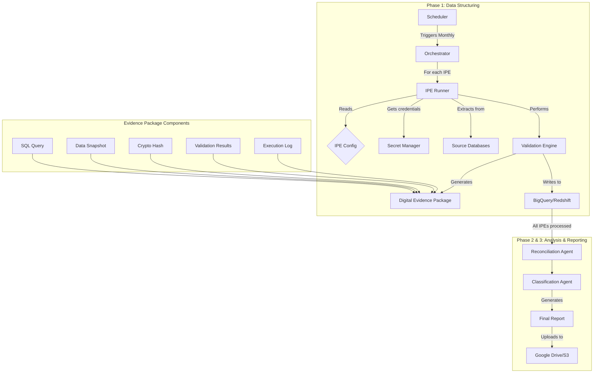

# SOXauto PG-01 🛡️

**Enterprise-Grade SOX Automation for Financial Reconciliation**

[](https://github.com/gvern/SOXauto)
[](https://www.sox-online.com/)
[](https://cloud.google.com/)
[](LICENSE)

> **Revolutionizing SOX compliance through intelligent automation and cryptographic evidence generation**

SOXauto PG-01 is an enterprise-grade automation system that transforms manual SOX reconciliation processes into secure, auditable, and scalable workflows. Built for financial institutions requiring bulletproof compliance and audit trails.

---

## 🎯 **What Makes SOXauto Revolutionary**

### Traditional Manual Process
- ❌ **15-30 minutes** per IPE extraction
- ❌ **Screenshot evidence** (alterable, limited coverage)
- ❌ **Manual validation** (error-prone)
- ❌ **Scattered documentation** (audit nightmare)
- ❌ **Human errors** and inconsistencies

### SOXauto Automated Process
- ✅ **2-3 minutes** per IPE extraction (90% faster)
- ✅ **Cryptographic evidence** (tamper-proof, complete coverage)
- ✅ **Automated validation** (consistent, reliable)
- ✅ **Structured audit packages** (enterprise-grade)
- ✅ **Zero human errors** in execution

---

## 🏗️ **Architecture Overview**



### Core Components

| Component | Role | Technology |
|-----------|------|------------|
| **Orchestrator** | Main workflow engine | Python + Flask |
| **IPE Runner** | Individual IPE processor | Python + Pandas |
| **Evidence Manager** | SOX compliance engine | Cryptographic hashing |
| **Cloud Utils** | Cloud service integration | GCP/AWS SDKs |
| **Validation Engine** | Data quality assurance | SQL + Statistical tests |

---

## 🚀 **Quick Start**

### Prerequisites
- Python 3.11+
- Docker
- Google Cloud SDK or AWS CLI
- SQL Server ODBC Driver

### Local Development
```bash
# Clone the repository
git clone https://github.com/gvern/SOXauto.git
cd SOXauto

# Install dependencies
pip install -r requirements.txt

# Set environment variables
export AWS_REGION="eu-west-1"
export CUTOFF_DATE="2024-05-01"

# Run IPE extraction (example)
python -m src.core.main

# Run timing difference bridge analysis
python -m src.bridges.timing_difference
```

### Docker Deployment
```bash
# Build the image
docker build -t soxauto-pg01 .

# Run the container
docker run -e AWS_REGION="eu-west-1" soxauto-pg01
```

---

## 📦 **What's Inside**

> **Professional Python package structure for scalability and production readiness**

```
PG-01/
├── 📁 src/                          # Source code (Python package)
│   ├── 📁 core/                     # Core application logic
│   │   ├── 🐍 __init__.py          # Package initialization
│   │   ├── 📄 main.py              # Flask orchestrator (Cloud Run entry point)
│   │   ├── ⚙️ config.py             # IPE configurations (secure CTE patterns)
│   │   ├── 🏃 ipe_runner.py         # IPE execution engine
│   │   └── 🛡️ evidence_manager.py   # Digital evidence system (SHA-256)
│   ├── � bridges/                  # Bridge analysis scripts
│   │   ├── 🐍 __init__.py          # Package initialization
│   │   └── 📊 timing_difference.py  # Timing difference bridge automation
│   ├── 📁 agents/                   # Future: Classification & reconciliation agents
│   │   └── 🐍 __init__.py          # Package initialization
│   └── 📁 utils/                    # Shared utilities
│       ├── 🐍 __init__.py          # Package initialization
│       └── 🔧 gcp_utils.py         # Google Cloud Platform abstractions
│
├── 📁 docs/                         # Comprehensive documentation
│   ├── 📁 architecture/             # Architecture diagrams
│   ├── 📁 deployment/               # Deployment guides
│   │   ├── 🚀 deploy.md            # GCP production deployment
│   │   └── ☁️ aws_migration.md     # AWS compatibility layer
│   ├── 📁 development/              # Development documentation
│   │   ├── 📊 classification_matrix.md    # Business rules
│   │   ├── 🤝 meeting_questions.md        # Stakeholder guide
│   │   ├── 📋 evidence_documentation.md   # Evidence system specs
│   │   └── 🔒 SECURITY_FIXES.md          # Security audit report
│   └── 📁 setup/                    # Setup instructions
│       └── 📝 TIMING_DIFFERENCE_SETUP.md  # Bridge setup guide
│
├── 📁 scripts/                      # Automation scripts
│   ├── 🔧 quick_wins.sh            # Quick documentation setup
│   └── 🔄 restructure.sh           # Project restructuring script
│
├── 📁 data/                         # Data files (gitignored)
│   ├── 📁 credentials/              # Service account credentials
│   └── 📁 outputs/                  # Bridge analysis outputs
│
├── 🐳 Dockerfile                   # Multi-stage production container
├── ☁️ cloudbuild.yaml              # Google Cloud Build configuration
├── 📋 requirements.txt             # Python dependencies
├── 🚫 .dockerignore               # Docker exclusions
└── 🚫 .gitignore                  # Git exclusions (includes data/)
```

### Key Technologies

| Component | Technology | Purpose |
|-----------|-----------|---------|
| **Orchestration** | Python + Flask | Cloud Run web server for workflow coordination |
| **Database Access** | pyodbc + pandas | Secure parameterized SQL execution |
| **Cloud Platform** | GCP (Secret Manager, BigQuery, Drive) | Enterprise cloud services |
| **Evidence System** | hashlib (SHA-256) | Cryptographic integrity verification |
| **Bridge Analysis** | gspread + Google Sheets API | Automated reconciliation identification |
| **Containerization** | Docker (multi-stage build) | Production-grade deployment |

---

## 🎮 **Digital Evidence System**

### Revolutionary Innovation
SOXauto generates **tamper-proof evidence packages** that surpass traditional screenshot methods:

#### Traditional Evidence (Manual)
```
📸 Screenshot.png
   - Shows ~20 rows
   - Easily alterable
   - No integrity verification
   - Limited audit value
```

#### SOXauto Evidence Package
```
📦 IPE_07_20241015_143025_evidence.zip
├── 📄 01_executed_query.sql        # Exact query with parameters
├── 📊 02_query_parameters.json     # Execution parameters
├── 📋 03_data_snapshot.csv         # Programmatic "screenshot"
├── 📈 04_data_summary.json         # Statistical overview
├── 🔐 05_integrity_hash.json       # SHA-256 cryptographic proof
├── ✅ 06_validation_results.json   # SOX test results
└── 📜 07_execution_log.json        # Complete audit trail
```

### Cryptographic Integrity
```python
# Each dataset gets a unique SHA-256 hash
"hash_value": "a1b2c3d4e5f6789012345abcdef..."

# ANY alteration changes the hash completely
original_hash  = "a1b2c3d4e5f6789012345abcdef..."
altered_hash   = "9z8y7x6w5v4u3t2s1r0q9p8o7n6m..."
                  ↑ Completely different = Tamper detected
```

---

## 🔧 **Configuration & Setup**

### AWS Authentication with Okta SSO

SOXauto supports **Okta SSO authentication** for secure AWS access. This is the recommended method for production use.

#### Quick Setup
```bash
# 1. Install AWS CLI v2 (required for SSO)
brew install awscli  # macOS
# or download from https://aws.amazon.com/cli/

# 2. Configure Okta profile (interactive)
python3 scripts/setup_okta_profile.py

# 3. Login via Okta
aws sso login --profile jumia-sox-prod

# 4. Set environment variables
export AWS_PROFILE=jumia-sox-prod
export USE_OKTA_AUTH=true
export AWS_REGION=eu-west-1
```

📚 **Detailed guide**: See [docs/setup/OKTA_AWS_SETUP.md](docs/setup/OKTA_AWS_SETUP.md)

### Environment Variables
```bash
# AWS Okta Configuration
export USE_OKTA_AUTH=true
export AWS_PROFILE=jumia-sox-prod
export AWS_REGION=eu-west-1

# Execution Parameters
export CUTOFF_DATE=2024-12-31  # Optional, defaults to current month
```

You can also use a `.env` file (copy from `.env.example`):
```bash
cp .env.example .env
# Edit .env with your settings
```

### Required Secrets (AWS Secrets Manager)
```bash
# Database connection string
aws secretsmanager create-secret \
  --name DB_CREDENTIALS_NAV_BI \
  --secret-string file://connection_string.txt \
  --region eu-west-1 \
  --profile jumia-sox-prod

# AWS credentials are managed via IAM roles in production
# For local development, use Okta SSO (recommended) or AWS CLI configuration
```

### IPE Configuration
IPEs are configured in `src/core/config.py` using a **secure CTE (Common Table Expression) pattern** to prevent SQL injection:

```python
IPE_CONFIGS = [
    {
        "id": "IPE_07",
        "description": "Customer ledger entries reconciliation",
        "secret_name": "DB_CREDENTIALS_NAV_BI",
        "main_query": """
            SELECT ... FROM [Customer Ledger Entry] WHERE [Posting Date] < ?
        """,
        "validation": {
            # Security: All validation queries use self-contained CTEs
            "completeness_query": """
                WITH main_data AS (
                    -- Full query with parameterized placeholders
                    SELECT ... WHERE [Posting Date] < ?
                )
                SELECT COUNT(*) FROM main_data
            """,
            "accuracy_positive_query": """
                WITH main_data AS (...)
                SELECT COUNT(*) FROM main_data WHERE witness_id = 239726184
            """,
            "accuracy_negative_query": """
                WITH main_data AS (...)
                SELECT COUNT(*) FROM main_data WHERE [Document No_] = 'EXCLUDED'
            """
        }
    }
]
```

**Security Note**: All queries use parameterized `?` placeholders and CTE patterns to eliminate SQL injection risks.

---

## 🎯 **SOX Validation Framework**

### Three-Tier Validation
Each IPE undergoes rigorous SOX compliance testing:

#### 1. Completeness Test
```sql
-- Ensures all expected records are captured
SELECT COUNT(*) FROM (main_extraction_query) 
-- Must match expected count from control query
```

#### 2. Accuracy Test (Positive)
```sql
-- Verifies witness transactions are included
SELECT COUNT(*) FROM (main_extraction_query) 
WHERE transaction_id = 'KNOWN_WITNESS_ID'
-- Must return > 0
```

#### 3. Accuracy Test (Negative)
```sql
-- Confirms excluded transactions are not present
SELECT COUNT(*) FROM (modified_extraction_query) 
WHERE transaction_id = 'KNOWN_EXCLUDED_ID'
-- Must return 0
```

### Validation Results
```json
{
  "completeness": {"status": "PASS", "expected": 12547, "actual": 12547},
  "accuracy_positive": {"status": "PASS", "witness_count": 1},
  "accuracy_negative": {"status": "PASS", "excluded_count": 0},
  "overall_compliance": true
}
```

---

## 🚀 **Production Deployment**

### Google Cloud Platform

#### 1. Enable Required APIs
```bash
gcloud services enable secretmanager.googleapis.com
gcloud services enable bigquery.googleapis.com
gcloud services enable run.googleapis.com
gcloud services enable cloudbuild.googleapis.com
```

#### 2. Deploy with Cloud Build
```bash
# Submit build
gcloud builds submit --config cloudbuild.yaml

# Verify deployment
curl https://your-cloud-run-url/health
```

#### 3. Schedule Monthly Execution
```bash
gcloud scheduler jobs create http sox-pg01-monthly \
    --schedule="0 9 1 * *" \
    --uri="https://your-service-url/" \
    --http-method=POST \
    --headers="Content-Type=application/json" \
    --message-body='{"cutoff_date": null}'
```

### Amazon Web Services
SOXauto is fully compatible with AWS. See [`aws_migration.md`](aws_migration.md) for detailed migration guide.

---

## 🧪 **Testing & Validation**

### Run Evidence System Demo
```bash
python test_evidence_system.py
```

**Output:**
```
🧪 DÉMONSTRATION - Système d'Évidence Digitale SOX
============================================================
1️⃣ Initialisation du gestionnaire d'évidence...
   📁 Package créé: /tmp/evidence/DEMO_IPE/20241015_143025_123

2️⃣ Création du package d'évidence...
   📊 Données créées: 500 lignes, 8 colonnes

3️⃣ Génération des preuves d'évidence...
   ✅ Requête SQL sauvegardée
   ✅ Échantillon de données sauvegardé
   ✅ Hash d'intégrité généré: a1b2c3d4e5f6789...
   ✅ Résultats de validation sauvegardés

🎉 DÉMONSTRATION TERMINÉE
```

### Health Check
```bash
curl https://your-deployment-url/health
```

```json
{
  "status": "healthy",
  "service": "SOXauto-PG01",
  "timestamp": "2024-10-15T14:30:25.123456"
}
```

---

## 📊 **Monitoring & Observability**

### Key Metrics to Monitor

| Metric | Threshold | Alert |
|--------|-----------|-------|
| Execution Time | > 10 minutes | Warning |
| Validation Failures | > 0 | Critical |
| Evidence Generation | Failed | Critical |
| Memory Usage | > 1.5GB | Warning |
| Error Rate | > 1% | Critical |

### Logging Structure
```json
{
  "timestamp": "2024-10-15T14:30:25.123456",
  "level": "INFO",
  "ipe_id": "IPE_07",
  "action": "VALIDATION_COMPLETED",
  "details": {
    "rows_processed": 12547,
    "validation_status": "PASS",
    "execution_time_ms": 2345
  }
}
```

### Dashboard Queries (BigQuery)
```sql
-- Daily execution summary
SELECT 
  DATE(extraction_timestamp) as execution_date,
  ipe_id,
  COUNT(*) as executions,
  SUM(CASE WHEN validation_status = 'SUCCESS' THEN 1 ELSE 0 END) as successful,
  AVG(execution_time_seconds) as avg_execution_time
FROM `project.dataset.audit_log`
WHERE DATE(extraction_timestamp) >= DATE_SUB(CURRENT_DATE(), INTERVAL 30 DAY)
GROUP BY 1, 2
ORDER BY 1 DESC, 2
```

---

## 🔐 **Security & Compliance**

### Security Features
- 🔐 **Secret Manager Integration** - No hardcoded credentials
- 🛡️ **Least Privilege IAM** - Minimal required permissions
- 🔒 **Data Encryption** - In transit and at rest
- 📜 **Audit Logging** - Complete activity trail
- 🏗️ **Container Security** - Non-root user, minimal attack surface

### SOX Compliance
- ✅ **Segregation of Duties** - Automated execution removes human bias
- ✅ **Data Integrity** - Cryptographic evidence prevents tampering
- ✅ **Audit Trail** - Complete documentation of all actions
- ✅ **Access Controls** - IAM-based permissions
- ✅ **Testing & Validation** - Automated control testing

### Required IAM Permissions
```json
{
  "roles": [
    "roles/secretmanager.secretAccessor",
    "roles/bigquery.dataEditor",
    "roles/storage.objectCreator",
    "roles/logging.logWriter"
  ]
}
```

---

## 🤝 **Contributing**

### Development Workflow
1. **Fork** the repository
2. **Create** a feature branch (`git checkout -b feature/amazing-feature`)
3. **Commit** your changes (`git commit -m 'Add amazing feature'`)
4. **Push** to the branch (`git push origin feature/amazing-feature`)
5. **Open** a Pull Request

### Code Standards
- **Python**: Follow PEP 8
- **Documentation**: Comprehensive docstrings
- **Testing**: Unit tests for new features
- **Security**: No hardcoded secrets or credentials

### Business Logic Changes
For modifications to IPE configurations or validation rules:
1. Update classification matrix
2. Document business justification
3. Get stakeholder approval
4. Implement with comprehensive testing

---

## 📋 **API Reference**

### Endpoints

#### Health Check
```http
GET /health
```
```json
{
  "status": "healthy",
  "service": "SOXauto-PG01",
  "timestamp": "2024-10-15T14:30:25.123456"
}
```

#### Configuration
```http
GET /config
```
```json
{
  "project_id": "jumia-sox-project",
  "bigquery_dataset": "jumia_sox_reconciliation",
  "configured_ipes": [
    {"id": "IPE_07", "description": "Customer ledger entries"},
    {"id": "CR_03_04", "description": "GL entries"}
  ],
  "total_ipes": 2
}
```

#### Execute Workflow
```http
POST /
Content-Type: application/json

{
  "cutoff_date": "2024-05-01"
}
```
```json
{
  "workflow_id": "SOXauto_PG01_20241015_143025",
  "overall_status": "SUCCESS",
  "summary": {
    "total_ipes": 2,
    "successful_ipes": 2,
    "failed_ipes": 0,
    "total_rows_processed": 25094
  }
}
```

---

## 🆘 **Troubleshooting**

### Common Issues

#### Connection Errors
```bash
# Check secret accessibility
gcloud secrets versions access latest --secret="DB_CREDENTIALS_NAV_BI"

# Test connectivity
telnet your-sql-server 1433
```

#### Memory Issues
```bash
# Increase Cloud Run memory
gcloud run services update soxauto-pg01 --memory 4Gi
```

#### Validation Failures
```bash
# Check validation logs
gcloud logs read "resource.type=cloud_run_revision" \
  --filter="jsonPayload.ipe_id=IPE_07"
```

### Debug Mode
```bash
# Enable detailed logging
export LOG_LEVEL=DEBUG
python main.py
```

### Support Contacts
- **Technical Issues**: [Insert technical team contact]
- **Business Rules**: [Insert business stakeholder contact]
- **Infrastructure**: [Insert DevOps team contact]

---

## 📈 **Performance Targets**

### Expected Execution Times (Production)
| IPE | Manual Process | SOXauto Target | Expected Improvement |
|-----|---------------|----------------|---------------------|
| IPE_07 | 25 minutes | 2-3 minutes | 🚀 ~90% faster |
| CR_03_04 | 20 minutes | 2-3 minutes | 🚀 ~90% faster |
| IPE_12 | 30 minutes | 2-3 minutes | 🚀 ~90% faster |

### Target Resource Usage
- **Memory**: <2GB peak (optimized for Cloud Run)
- **CPU**: 1-2 cores during execution
- **Storage**: ~50MB evidence per IPE
- **Network**: ~10MB data transfer per execution

---

## 🏆 **Success Targets**

### Project Objectives
- ⏱️ **Time Savings Target**: 90% reduction in manual effort
- 🎯 **Accuracy Goal**: 99%+ automated validation success rate
- 🛡️ **Compliance Goal**: 100% audit-ready evidence packages
- 💰 **Cost Reduction Target**: 80%+ decrease in operational costs
- 📊 **Scalability Goal**: Handle 50+ IPEs without performance degradation

### Expected Business Impact
- **Risk Reduction**: Eliminate human errors in SOX processes
- **Audit Confidence**: Cryptographic evidence to satisfy external auditors
- **Operational Efficiency**: Redirect team focus to value-added analysis
- **Compliance Assurance**: Automated controls for consistent compliance

### POC Success Criteria
- ✅ **Phase 1**: Successful IPE data extraction and validation
- 🔄 **Phase 2**: Agent-based reconciliation and classification
- 📊 **Phase 3**: Automated report generation and delivery

---

## 📚 **Additional Resources**

### Documentation
- 📋 [Classification Matrix](classification_matrix.md) - Business rules and logic
- 🤝 [Meeting Questions](meeting_questions.md) - Stakeholder alignment guide
- 🚀 [Deployment Guide](deploy.md) - Production deployment instructions
- ☁️ [AWS Migration](aws_migration.md) - AWS compatibility and migration
- 🛡️ [Evidence System](evidence_documentation.md) - Digital evidence framework

### External Links
- [SOX Compliance Guidelines](https://www.sox-online.com/)
- [Google Cloud Run Documentation](https://cloud.google.com/run/docs)
- [AWS Fargate Documentation](https://aws.amazon.com/fargate/)
- [Python Security Best Practices](https://python.org/dev/security/)

---

## 📄 **License**

This project is licensed under the Enterprise License - see the [LICENSE](LICENSE) file for details.

---

## 🙏 **Acknowledgments**

- **Business Stakeholders** for domain expertise and validation
- **Audit Team** for compliance requirements and testing
- **Infrastructure Team** for cloud platform support
- **Security Team** for security architecture review

---

## 🎯 **Roadmap**

### Upcoming Features
- 🤖 **AI-Powered Anomaly Detection** - ML-based outlier identification
- 📊 **Real-time Dashboards** - Live monitoring and reporting
- 🔄 **Multi-tenant Support** - Support for multiple subsidiaries
- 📱 **Mobile Notifications** - Instant alerts for critical issues
- 🌐 **API Expansion** - RESTful APIs for external integrations

### Long-term Vision
Transform SOXauto into a comprehensive financial automation platform covering all SOX requirements across the organization.

---

**🎉 SOXauto PG-01: Where Compliance Meets Innovation**

*Built with ❤️ for enterprise-grade financial automation*