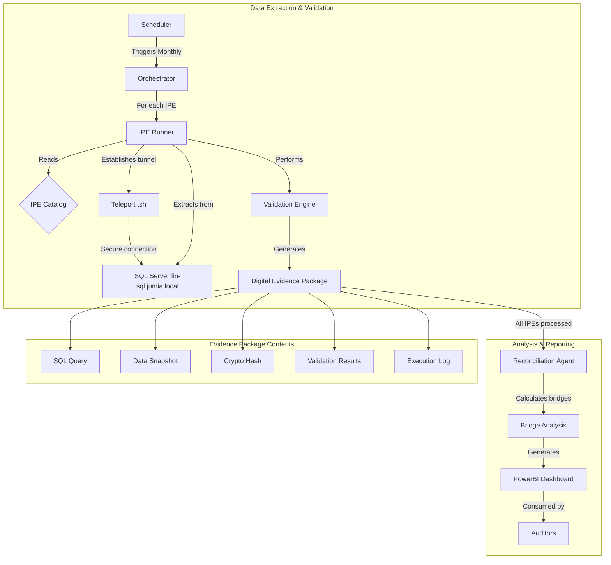

# SOXauto PG-01

> NOTE ON CURRENT PROJECT STATE
>
> The system connects directly to on-premises SQL Server (`fin-sql.jumia.local`) via a secure **Teleport (`tsh`)** tunnel. All data extraction is performed using the `mssql_runner.py` module. For the current operational status and next actions, see `PROJECT_DASHBOARD.md`.

## Connection Architecture

The system connects to the on-premises SQL Server database via:

- **Database Server**: `fin-sql.jumia.local`
- **Connection Method**: Secure Teleport (`tsh`) tunnel
- **Runner Module**: `src/core/runners/mssql_runner.py`
- **Evidence System**: Full Digital Evidence Package generation for SOX compliance

For detailed implementation status and tracking, see `PROJECT_DASHBOARD.md`.

## Quick Demo (offline)

Run a 3-phase demo (Extraction → Reconciliation → Bridges) with sample data:

```bash
python3 scripts/run_demo.py --ipe IPE_07
```

What it does:

- Phase 1: Loads a sample CSV for the chosen IPE, generates a Digital Evidence Package (6 files without hash) under `evidence/<IPE>/...`.
- Phase 2: Computes a simple reconciliation between NAV GL actuals and the IPE total.
- Phase 3: Applies bridge classification rules on a small IPE_31-like sample and prints a preview.

Notes:

- The script auto-creates minimal CSVs in `tests/fixtures/historical_data/` if they’re missing: `<IPE>.csv`, `actuals_nav_gl.csv`, `i31_transactions.csv`.
- To use your own historical files, drop them in `tests/fixtures/historical_data/` with the same filenames.

## Enterprise-Grade SOX Automation for Financial Reconciliation

[](https://github.com/gvern/SOXauto)
[](https://www.sox-online.com/)
[](https://aws.amazon.com/)
[](LICENSE)

> **Revolutionizing SOX compliance through intelligent automation and cryptographic evidence generation**

SOXauto PG-01 is an enterprise-grade automation system that transforms manual SOX reconciliation processes into secure, auditable, and scalable workflows. Built for financial institutions requiring bulletproof compliance and audit trails.

------

## What Makes SOXauto Revolutionary

### Traditional Manual Process

- **15-30 minutes** per IPE extraction
- **Screenshot evidence** (alterable, limited coverage)
- **Manual validation** (error-prone)
- **Scattered documentation** (audit nightmare)
- **Human errors** and inconsistencies

### SOXauto Automated Process

- **2-3 minutes** per IPE extraction (90% faster)
- **Cryptographic evidence** (tamper-proof, complete coverage)
- **Automated validation** (consistent, reliable)
- **Structured audit packages** (enterprise-grade)
- **Zero human errors** in execution

------

## Architecture Overview



### Core Components

| Component | Role | Technology |
|-----------|------|------------|
| **Orchestrator** | Main workflow engine | Python + Flask |
| **IPE Runner** | Individual IPE processor | Python + Pandas |
| **Evidence Manager** | SOX compliance engine | Cryptographic hashing |
| **Database Connection** | Secure tunnel to SQL Server | Teleport (tsh) |
| **Validation Engine** | Data quality assurance | SQL + Statistical tests |

------

## The Complete SOXauto Workflow: From Auth to Evidence

The system is designed as a clear, linear pipeline. Understanding this workflow is key to seeing how all the pieces fit together.

### The High-Level Process

The entire operation can be visualized in five distinct stages:

### Authentication → Orchestration → Execution → Validation → Evidence Generation

Here’s a step-by-step breakdown:

#### 1. Connection Setup (Secure Tunnel)

- **What happens**: The system establishes a secure connection to the on-premises SQL Server via Teleport (`tsh`).
- **Key Scripts**: `src/core/runners/mssql_runner.py`
- **Result**: A secure, authenticated connection to `fin-sql.jumia.local` is established.

#### 2. Orchestration (The "Workflow")

- **What happens**: The `execute_ipe_workflow` function in `workflow.py` kicks off the main process. It loops through all the IPEs defined in your catalog and runs them one by one.
- **Key Scripts**: `src/orchestrators/workflow.py`
- **Result**: Each IPE is passed to the appropriate runner for execution.

#### 3. Execution (The "Runner")

- **What happens**: The `IPERunner` class takes an IPE definition from the catalog. It formats the SQL query, replacing placeholders like `{cutoff_date}` with the correct values. It then executes this query against the SQL Server database via the Teleport tunnel.
- **Key Scripts**: `src/core/runners/mssql_runner.py`, `src/core/catalog/cpg1.py`
- **Result**: A pandas DataFrame containing the raw data extract for that IPE.

#### 4. Validation (The "SOX Check")

- **What happens**: After the data is extracted, the `mssql_runner` performs validation tests on the DataFrame based on the rules defined in the catalog (`critical_columns`, `accuracy_positive`, etc.).
- **Key Scripts**: `src/core/runners/mssql_runner.py` (the `_validate_data` method).
- **Result**: A JSON object containing the PASS/FAIL status for each validation rule (Completeness, Accuracy).

#### 5. Evidence Generation (The "Audit Trail")

- **What happens**: Throughout the execution and validation process, the `DigitalEvidenceManager` is called to create a comprehensive, tamper-proof audit trail.
- **Key Scripts**: `src/core/evidence/manager.py`
- **Result**: A zipped evidence package containing the 7 critical files (the executed query, data snapshot, cryptographic hash, validation results, etc.) is saved to the `/evidence` directory.

------

## Quick Start

### Prerequisites

- Python 3.11+
- Docker
- Teleport (`tsh`) client configured with access to `fin-sql.jumia.local`
- SQL Server ODBC Driver

### Local Development

```bash
# Clone the repository
git clone https://github.com/gvern/SOXauto.git
cd SOXauto

# Install dependencies
pip install -r requirements.txt

# Set environment variables
export CUTOFF_DATE="2024-05-01"

# Establish Teleport tunnel
tsh login --proxy=teleport.jumia.com --user=your-username
tsh db connect fin-sql

# Run IPE extraction (example)
python -m src.core.main

# Run timing difference bridge analysis
python -m src.bridges.timing_difference
```

### Docker Deployment

```bash
# Build the image
docker build -t soxauto-pg01 .

# Run the container
docker run -e AWS_REGION="eu-west-1" soxauto-pg01
```

------

## Project Structure

> **Professional Python package structure with clear separation of concerns**

```plaintext
PG-01/
├── src/                          # Source code (Python package)
│   ├── core/                     # Core application logic
│   │   ├── catalog/              # IPE/CR catalog (single source of truth)
│   │   │   ├── __init__.py
│   │   │   └── cpg1.py            # Unified C-PG-1 definitions
│   │   ├── runners/              # Execution engines
│   │   │   ├── __init__.py
│   │   │   └── mssql_runner.py   # SQL Server via Teleport
│   │   ├── evidence/             # SOX compliance
│   │   │   ├── __init__.py
│   │   │   └── manager.py        # Digital evidence (SHA-256)
│   │   ├── recon/                # Reconciliation logic
│   │   │   ├── __init__.py
│   │   │   └── cpg1.py           # CPG1 business rules
│   │   └── main.py               # Flask orchestrator entry point
│   ├── bridges/                  # Bridge analysis scripts
│   │   ├── __init__.py
│   │   └── timing_difference.py  # Timing difference automation
│   ├── agents/                   # Future: AI agents
│   │   └── __init__.py
│   └── utils/                    # Shared utilities
│       ├── __init__.py
│       ├── aws_utils.py           # AWS service abstractions
│       └── okta_aws_auth.py      # Okta SSO integration
│
├── docs/                         # Comprehensive documentation
│   ├── architecture/             # System design
│   │   └── DATA_ARCHITECTURE.md
│   ├── deployment/               # Deployment guides
│   │   └── aws_deploy.md
│   ├── development/              # Development guides
│   │   ├── TESTING_GUIDE.md
│   │   ├── SECURITY_FIXES.md
│   │   └── evidence_documentation.md
│   └── setup/                    # Setup instructions
│       ├── DATABASE_CONNECTION.md
│       ├── OKTA_AWS_SETUP.md
│       └── OKTA_QUICK_REFERENCE.md
│
├── scripts/                      # Automation scripts
│   ├── check_mssql_connection.py # Database connection verification
│   └── validate_ipe_config.py    # Config validation
│
├── tests/                        # Test suite
│   ├── test_database_connection.py
│   └── test_single_ipe_extraction.py
│
├── IPE_FILES/                    # IPE baseline files
├── evidence/                     # SOX evidence packages
├── data/                         # Runtime data (gitignored)
│   └── outputs/                     # Analysis outputs
│
├── Dockerfile                   # Multi-stage production container
├── requirements.txt             # Python dependencies
├── .gitignore                  # Git exclusions
└── README.md                   # This file
```

### Key Technologies

| Component | Technology | Purpose |
|-----------|-----------|---------|
| **Orchestration** | Python 3.11 + Flask | Web server for workflow coordination |
| **Data Access** | pyodbc + Teleport | SQL Server via secure tunnel |
| **Database Connection** | Teleport (`tsh`) | Secure tunnel to on-premises SQL Server |
| **Evidence System** | hashlib (SHA-256) | Cryptographic integrity verification |
| **Containerization** | Docker (multi-stage build) | Production deployment |

------

## Digital Evidence System

Every IPE extraction generates a tamper-proof **Digital Evidence Package**:

```json
{
  "evidence_id": "IPE_07_20250930_143522_abc123",
  "ipe_id": "IPE_07",
  "cutoff_date": "2025-09-30",
  "extraction_timestamp": "2025-09-30T14:35:22.531Z",
  "data_hash": "8f3d2a1c5b7e...4f9a",
  "row_count": 15847,
  "validation_status": "PASS",
  "critical_column_completeness": {
    "customer_no": 100.0,
    "document_no": 100.0,
    "posting_date": 100.0
  }
}
```

### Package Contents

1. **Data Extract** (`ipe_data.csv`) - Raw query results
2. **Evidence Metadata** (`evidence.json`) - Full audit trail
3. **Execution Log** (`execution.log`) - Detailed operation log
4. **SHA-256 Integrity Hash** - Cryptographic verification

This is **legally admissible** evidence for SOX audits.

------

## Security

### Connection Security

SOXauto uses Teleport for secure database access:

- **Teleport Tunnel**: All database connections are established through a secure `tsh` tunnel
- **No Direct Access**: Database credentials are never stored locally
- **Audit Logging**: All connections are logged through Teleport's audit system

### Security Best Practices

- **No hardcoded credentials** - All connections via Teleport
- **Parameterized queries** - SQL injection prevention
- **Cryptographic hashing** - Evidence integrity (SHA-256)
- **Docker non-root user** - Container security

------

## IPE Catalog

SOXauto manages 10+ C-PG-1 IPEs and Control Reports:

| IPE ID | Title | Data Source | Status |
|--------|-------|-------------|--------|
| **IPE_07** | Customer balances - Monthly balances at date | SQL Server | Complete |
| **IPE_08** | Store credit vouchers TV | SQL Server | Complete |
| **IPE_09** | BOB Sales Orders | SQL Server | Complete |
| **IPE_10** | Customer prepayments TV | SQL Server | In Progress |
| **IPE_11** | Seller Center Liability reconciliation | SQL Server | Complete |
| **IPE_12** | TV - Packages delivered not reconciled | SQL Server | In Progress |
| **IPE_31** | PG detailed TV extraction | SQL Server | In Progress |
| **IPE_34** | Marketplace refund liability | SQL Server | In Progress |
| **CR_01** | Reconciliation: SC - NAV | Multiple | Complete |
| **DOC_001** | IPE Catalog Master | N/A | Complete |

All IPE definitions live in `src/core/catalog/cpg1.py` - the single source of truth.

------

## Testing

### Run Tests

```bash
# Full test suite
pytest tests/

# Specific tests
python3 tests/test_database_connection.py
python3 tests/test_single_ipe_extraction.py

# Validate IPE configuration
python3 scripts/validate_ipe_config.py
```

### Test Coverage

- SQL Server connectivity via Teleport
- IPE extraction workflow
- Evidence generation
- Validation engine
- Bridge classification

------

## Documentation

Comprehensive documentation available in `docs/`:

### Setup Guides

- **[DATABASE_CONNECTION.md](docs/setup/DATABASE_CONNECTION.md)** - Database connectivity guide via Teleport
- **[TIMING_DIFFERENCE_SETUP.md](docs/setup/TIMING_DIFFERENCE_SETUP.md)** - Timing difference configuration

### Architecture

- **[DATA_ARCHITECTURE.md](docs/architecture/DATA_ARCHITECTURE.md)** - System architecture

### Development

- **[TESTING_GUIDE.md](docs/development/TESTING_GUIDE.md)** - Testing best practices
- **[SECURITY_FIXES.md](docs/development/SECURITY_FIXES.md)** - Security audit findings
- **[evidence_documentation.md](docs/development/evidence_documentation.md)** - Evidence system specs
- **[RUNNING_EXTRACTIONS.md](docs/development/RUNNING_EXTRACTIONS.md)** - Running extractions with SQL parameters

### Deployment

- **[RECONCILIATION_FLOW.md](docs/development/RECONCILIATION_FLOW.md)** - Reconciliation workflow

------

## Roadmap

### Phase 1: Foundation (Current)

- [x] Core IPE extraction engine
- [x] Digital evidence system
- [x] SQL Server connectivity via Teleport
- [x] Unified IPE catalog
- [ ] Complete all IPE implementations

### Phase 2: Intelligence (Q1 2026)

- [ ] AI-powered reconciliation agent
- [ ] Automatic bridge identification
- [ ] Anomaly detection
- [ ] Natural language reports

### Phase 3: Scale (Q2 2026)

- [ ] Multi-entity support
- [ ] Real-time dashboards
- [ ] Advanced analytics
- [ ] API for external systems

------

## Contributing

This is an enterprise internal project. For access or contributions:

1. **Authentication**: Ensure Okta SSO access
2. **AWS Permissions**: Request IAM role assignment
3. **Development**: Follow the setup guide in `docs/setup/`
4. **Testing**: Run full test suite before commits

------

## License

Enterprise proprietary software. All rights reserved.

------

## Resources

- **Teleport**: [Teleport Documentation](https://goteleport.com/docs/)
- **SOX Compliance**: [SOX Online](https://www.sox-online.com/)
- **SQL Server**: [Microsoft SQL Server Documentation](https://docs.microsoft.com/en-us/sql/)

------

Built with love for enterprise-grade SOX compliance
